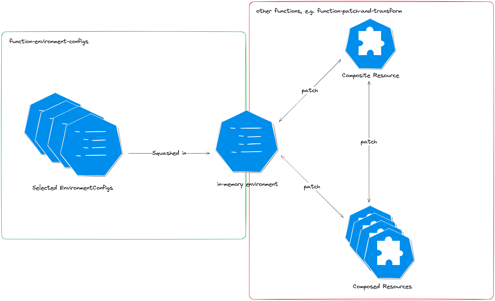

# function-environment-configs

[](https://github.com/crossplane-contrib/function-environment-configs/actions/workflows/ci.yml) 

> [!WARNING]
> This function relies on functionalities only available in Crossplane 1.15 and
> later. It will not work with earlier versions.

> [!IMPORTANT]  
> This function is meant to replace native 
> [Composition Environment][upstream-docs-environment-configs]
> (`--enable-environment-configs`), see
> [below](#migration-from-native-composition-environment) for more details.

This [composition function][docs-functions] allows you to request
`EnvironmentConfigs`, merge them in the requested order and return inject the
computed `environment` into the `Context` at a well-known key,
`apiextensions.crossplane.io/environment`, so that other functions such as
[function-patch-and-transform] can access it.

## Using this function

See the [example](example) directory for examples that you can run locally using
the Crossplane CLI:

```shell
$ crossplane beta render \
  --extra-resources example/environmentConfigs.yaml \
  --include-context \
  example/xr.yaml example/composition.yaml example/functions.yaml
```

To validate the rendered output, you can use the `crossplane beta validate` command:
```shell
$ crossplane beta render \
  --extra-resources example/environmentConfigs.yaml \
  --include-full-xr \
  example/xr.yaml example/composition.yaml example/functions.yaml | crossplane beta validate example -
```

See the [composition functions documentation][docs-functions] to learn more
about `crossplane beta render`.

## Migration from native Composition Environment

Crossplane 1.18 [dropped] native Composition Environment, meaning
`spec.environment` and `*Environment` patches were removed, while
`EnvironmentConfig` as a resource was promoted to `Beta`.

`crossplane beta convert pipeline-composition` has been updated to
automatically migrate Compositions using those fields to this function.

A manual migration can be performed moving the following fields from a
`Composition` spec to this function's `Input`:
- `spec.environment.environmentConfigs` -> `spec.environmentConfigs`
- `spec.environment.defaultData` -> `spec.defaultData`
- `spec.environment.policy.resolution` -> `spec.policy.resolution`

`spec.environment.policy.resolve` is not configurable at the moment, defaulting
to policy `Always`.

`spec.environment.patches` and resources' `*Environment` patches will have to
be moved to [function-patch-and-transform]'s input.

The diagram below shows what part of the usual Composition is replaced by this
function and how it fits with other functions:



### Migration Example

Given an example `Resource`-mode Composition:
  
> [!WARNING]
> The example below is using the old native Composition Environment, which was dropped in Crossplane 1.18.

<details><summary>Old Resource-mode Composition</summary>
<p>

```yaml
apiVersion: apiextensions.crossplane.io/v1
kind: Composition
metadata:
   name: foo
spec:
   compositeTypeRef:
      apiVersion: example.crossplane.io/v1
      kind: XR
   mode: Resources
   environment:
      environmentConfigs:
      - type: Reference
        ref:
           name: example-config
      patches:
      # So you can then use it in all your patches:
      # - Env -> XR
      - type: ToCompositeFieldPath
        fromFieldPath: "someFieldInTheEnvironment"
        toFieldPath: "status.someFieldFromTheEnvironment"
      # - XR -> Env
      - type: FromCompositeFieldPath
        fromFieldPath: "spec.someFieldInTheXR"
        toFieldPath: "someFieldFromTheXR"
   resources:
   - name: bucket
     base:
       apiVersion: s3.aws.upbound.io/v1beta1
       kind: Bucket
       spec:
         forProvider:
           region: us-east-2
     patches:
       # - Env -> Resource
       - type: FromEnvironmentFieldPath
         fromFieldPath: "someFieldInTheEnvironment"
         toFieldPath: "spec.forProvider.someFieldFromTheEnvironment"
       # - Resource -> Env
       - type: ToEnvironmentFieldPath
         fromFieldPath: "status.someOtherFieldInTheResource"
         toFieldPath: "someOtherFieldInTheEnvironment"

```

</p>
</details> 

The above can be converted to use this function and
[function-patch-and-transform] as follows:

```yaml
apiVersion: apiextensions.crossplane.io/v1
kind: Composition
metadata:
   name: foo
spec:
  compositeTypeRef:
    apiVersion: example.crossplane.io/v1
    kind: XR
  mode: Pipeline
  pipeline:
  - step: environmentConfigs
    functionRef:
      name: function-environment-configs
    input:
      apiVersion: environmentconfigs.fn.crossplane.io/v1beta1
      kind: Input
      spec:
        environmentConfigs:
        - type: Reference
          ref:
            name: example-config
    # the environment is be passed to the next function in the pipeline
    # as part of the context
  - step: patch-and-transform
    # function-patch-and-transform knows it has to look for the environment in the
    # context at "apiextensions.crossplane.io/environment"
    functionRef:
      name: function-patch-and-transform
    input:
      apiVersion: pt.fn.crossplane.io/v1beta1
      kind: Resources
      environment:
        patches:
        # So you can then use it in all your patches:
        # - Env -> XR
        - type: ToCompositeFieldPath
          fromFieldPath: "someFieldInTheEnvironment"
          toFieldPath: "status.someFieldFromTheEnvironment"
        # - XR -> Env
        - type: FromCompositeFieldPath
          fromFieldPath: "spec.someFieldInTheXR"
          toFieldPath: "someFieldFromTheXR"
        resources:
        - name: bucket
          base:
            apiVersion: s3.aws.upbound.io/v1beta1
            kind: Bucket
            spec:
              forProvider:
                region: us-east-2
          patches:
          # - Env -> Resource
          - type: FromEnvironmentFieldPath
            fromFieldPath: "someFieldInTheEnvironment"
            toFieldPath: "spec.forProvider.someFieldFromTheEnvironment"
          # - Resource -> Env
          - type: ToEnvironmentFieldPath
            fromFieldPath: "status.someOtherFieldInTheResource"
            toFieldPath: "someOtherFieldInTheEnvironment"
```

## Consuming environment from Context-aware functions

This function just merges selected `EnvironmentConfigs` into the `Context` at a well-known key, `apiextensions.crossplane.io/environment`, therefore any `Context`-aware function can access it.

For example, using [function-go-templating]:

```yaml
apiVersion: apiextensions.crossplane.io/v1
kind: Composition
metadata:
   name: foo
spec:
  compositeTypeRef:
    apiVersion: example.crossplane.io/v1
    kind: XR
  mode: Pipeline
  pipeline:
  - step: environmentConfigs
    functionRef:
      name: function-environment-configs
    input:
      apiVersion: environmentconfigs.fn.crossplane.io/v1beta1
      kind: Input
      spec:
        environmentConfigs:
        - type: Reference
          ref:
            name: example-config
    # the environment is be passed to the next function in the pipeline
    # as part of the context
  - step: go-templating
    functionRef:
      name: function-go-templating
    input:
      apiVersion: gotemplating.fn.crossplane.io/v1beta1
      kind: GoTemplate
      source: Inline
      inline:
        template: |
          ---
          apiVersion: example.crossplane.io/v1
          kind: XR
          status:
            fromEnv: {{ index .context "apiextensions.crossplane.io/environment" "complex" "c" "d" }}
```

### Environment Configuration Resource Sourcing

#### Type Reference
Source type `Reference` selects an environment configuration with the exact matching name.

```yaml
< composition code removed for brevity >
  - step: environmentConfigs
    functionRef:
      name: function-environment-configs
    input:
      apiVersion: environmentconfigs.fn.crossplane.io/v1beta1
      kind: Input
      spec:
        environmentConfigs:
        - type: Reference
          ref:
            name: example-config
< composition code removed for brevity >
```

#### Type Selector
Source type `Selector` selects an environment configuration with the exact matching name. Two selection modes are available; `Single` and `Multiple`. `Single` mode selects a single `environmentConfig` resource based on the labels of the `environmentConfig` and `Multiple` selects multiple `environmentConfig` resources. Mode will default to `Single` if omitted. 

Each label matcher accepts two types of matching; `Value` and `ValueFromFieldPath`. Type `Value` accepts a literal key/value to match and type `FromCompositeFieldPath` accepts a field input from the composite resource. 


Type `Selector` also supports inputs from the composite resource.
###### Single Mode
```yaml
< composition code removed for brevity >
  - step: environmentConfigs
    functionRef:
      name: function-environment-configs
    input:
      apiVersion: environmentconfigs.fn.crossplane.io/v1beta1
      kind: Input
      spec:
        environmentConfigs:
        - type: Selector
          selector:
            mode: Single
            matchLabels: 
              # type 'Value' 
              - type: Value
                # String literal of the label key to match 
                key: example-label-a-key
                # String literal of the label value to match 
                value: example-label-a-value
        - type: Selector
          selector:
            mode: Single
            matchLabels: 
              # type 'FromCompositeFieldPath' 
              # 'type' will default to 'FromCompositeFieldPath' if omitted.
              - type: FromCompositeFieldPath
                key: example-label-b-key
                # valueFromFieldPath expects the field path to get the key's value from within the composite resource.
                valueFromFieldPath: spec.example.b
                # FromFieldPathPolicy accepts values of 'Required' or 'Optional'. It defaults to 'Required' if omitted.
                # If set to 'Required', the function will throw an error if the field is not found in the field of the composite resource.
                # Instead if 'Optional' is set the label pair will be skipped if the field does not exist and other matchingLabels will be used if any others exist.
                FromFieldPathPolicy: Required
< composition code removed for brevity >
```

###### Multiple Mode
Multiple mode differs from Single mode in that it will match several `environmentConfig` resources instead of a single `environmentConfig` resource. It accepts all of the same arguments as `Single` mode along with a few specific fields only available in `Multiple` mode.

```yaml
< composition code removed for brevity >
  - step: environmentConfigs
    functionRef:
      name: function-environment-configs
    input:
      apiVersion: environmentconfigs.fn.crossplane.io/v1beta1
      kind: Input
      spec:
        environmentConfigs:
        - type: Selector
          selector:
            mode: Multiple
            matchLabels: 
              # type 'Value' 
              - type: Value
                # String literal of the label key to match 
                key: example-label-a-key
                # String literal of the label value to match 
                value: example-label-a-value
          # 'maxMatch' is an optional argument that sets the maximum number of environmentConfigs to pull. Pulls all if omitted.
          # Only supported in 'Multiple' mode
          maxMatch: 3
          # 'minMatch' is an optional argument that  the required minimum number of environmentConfigs to pull.
          # Only supported in 'Multiple' mode
          minMatch: 1
          # 'sortByFieldPath' is an optional argument that sets the field path on how the pulled environmentConfigs is alphabetically sorted.
          # Only supported in 'Multiple' mode. Defaults to "metadata.name" if omitted.
          sortByFieldPath: metadata.name
< composition code removed for brevity >
```

### Default data
```yaml
< removed for brevity >
  - step: environmentConfigs
    functionRef:
      name: function-environment-configs
    input:
      apiVersion: environmentconfigs.fn.crossplane.io/v1beta1
      kind: Input
      spec:
        # Default data that can be overridden by EnvironmentConfigs being pulled
        defaultData:
          a: 
            a1: example-a1
            a2: example-a2
          b: example-b
        environmentConfigs:
        - type: Reference
          ref:
            name: example-config
< removed for brevity >
```

## Developing this function

This function uses [Go][go], [Docker][docker], and the [Crossplane CLI][cli] to
build functions.

```shell
# Run code generation - see input/generate.go
$ go generate ./...

# Run tests - see fn_test.go
$ go test ./...

# Build the function's runtime image - see Dockerfile
$ docker build . --tag=runtime

# Build a function package - see package/crossplane.yaml
$ crossplane xpkg build -f package --embed-runtime-image=runtime
```

[bsr]: https://buf.build/crossplane/crossplane/docs/main:apiextensions.fn.proto.v1beta1#apiextensions.fn.proto.v1beta1.RunFunctionRequest
[cli]: https://docs.crossplane.io/latest/cli
[docker]: https://www.docker.com
[docs-functions]: https://docs.crossplane.io/latest/concepts/compositions/
[dropped]: https://github.com/crossplane/crossplane/pull/5938
[function-go-templating]: https://github.com/crossplane-contrib/function-go-templating
[function-patch-and-transform]: https://github.com/crossplane-contrib/function-patch-and-transform
[go]: https://go.dev
[upstream-docs-environment-configs]: https://docs.crossplane.io/latest/concepts/environment-configs/
